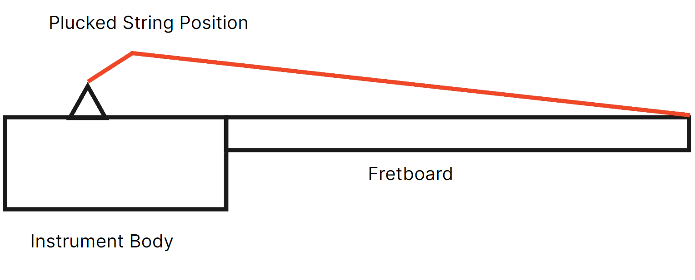

# Karplus-Strong Synthesis

The Karplus-Strong synthesis algorithm is a method for generating realistic plucked string instrument sounds, such as those produced by guitars, banjos, and other similar instruments. It was developed by Kevin Karplus and Alex Strong in the 1980s. By emulating the physical properties of a plucked instrument, this algorithm is an example of physical modelling synthesis.

## Physical Modelling Synthesis

The process involves creating a mathematical model that represents the physical attributes of an instrument, such as the shape and material of its components, the way it produces sound, and how that sound interacts with the environment. This model is then used to simulate the behavior of the instrument in a virtual environment, allowing for the synthesis of realistic and expressive sounds.

When a string is plucked, it is initially held to one side. Once it is let go, the string will vibrate freely to feed energy into the body of the instrument.

## Karplus-Strong: Deepdive

Below is a simplified version of the Karplus-Strong schematic.

The diagram above highlights the main points to the Karplus-Strong synthesis model. This can be added to, with more filters and effects. Additionally, the feedback can be controlled to change the tone of the output, along with adding gain controls.

A basic overview of this algorithm:

* Random Noise: Fill the buffer with random noise. This noise serves as the initial excitation for the virtual string. In this example, we fill the buffer using a noise gate. The length of the gate is determined by the frequency of the note pressed.

* Filtering: Apply a simple low-pass filter to the noise signal. The filter attenuates higher frequencies and emphasizes the fundamental frequency of the string. This filter models the dampening of high-frequency components as the string vibrates.

* Feedback Loop: Create a feedback loop by continuously processing the buffer. This mimics the vibration of a plucked string, where energy travels back and forth along the string. The length of the feedback loop is determined by the frequency of the note pressed.

* Pitch Control: By adjusting the delay length in the feedback loop, you can control the pitch of the generated sound. Longer delays produce higher pitches, while shorter delays create lower pitches.

* Output: The generated samples from the buffer are used as the output audio signal. By continuously updating the buffer with the feedback loop, the algorithm simulates the sustained sound of a vibrating string.

The Karplus-Strong algorithm is computationally efficient and can produce convincing string-like sounds with a relatively small amount of data. It is a fundamental technique used in physical modeling synthesis for emulating the sounds of plucked string instruments.
